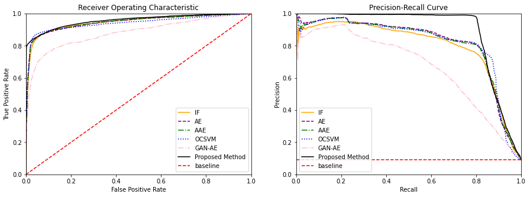

# Financial Fraud Detection with Semi-supervised Adversarial Autoencoder

## this is the simplified demonstration repo

Result are given as below, my approach outperforms other one-class classification method on imbalanced credit card fraud dataset

